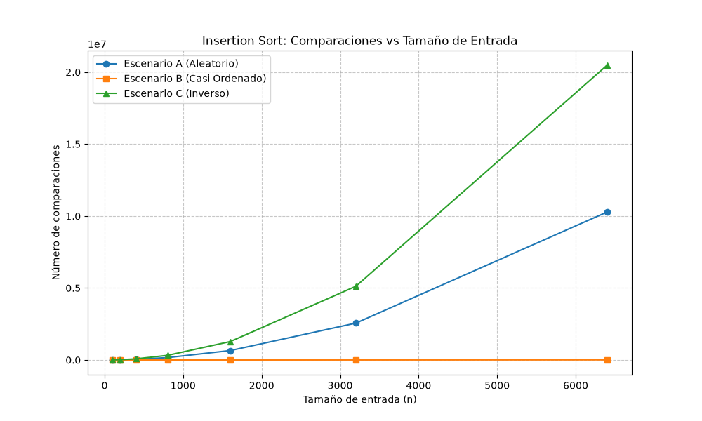
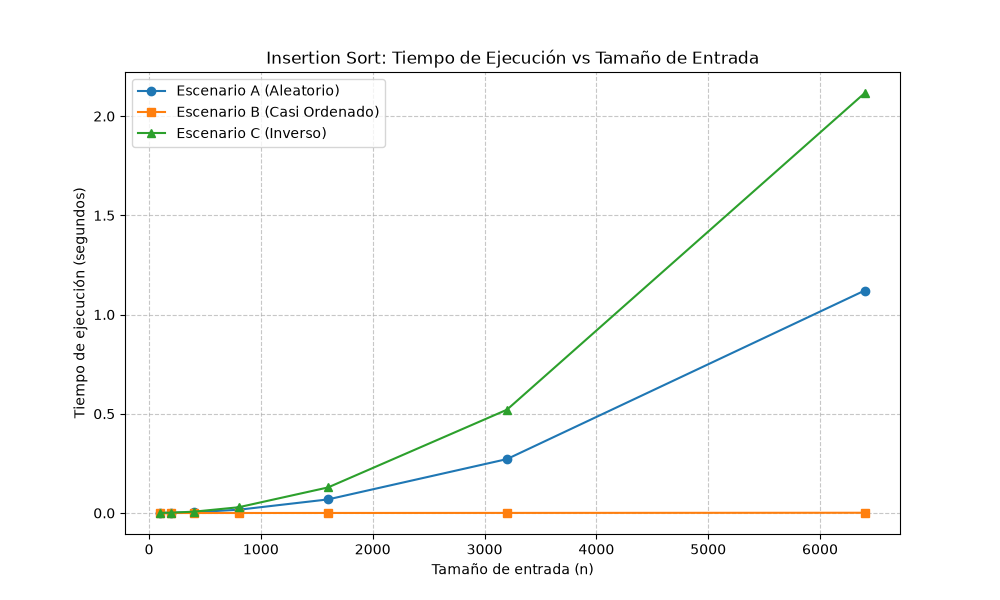
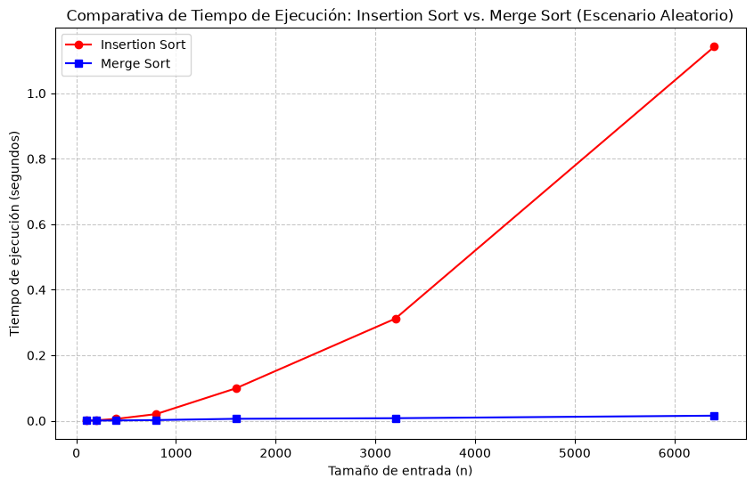

# Pablo Tabares Cardona

# Instrucciones de reproducción

## 1. Activar el entorno virtual

Desde la raíz del repositorio:

- En Windows PowerShell:

    ```powershell
    .\venv\Scripts\Activate.ps1
    ```

- En Windows CMD:

    ```cmd
    .\venv\Scripts\activate.bat
    ```

- En Git Bash / Bash:
    ```bash
    source venv/Scripts/activate
    ```

Si el entorno no existe, créelo primero con:

```bash
python -m venv venv
```

Y luego instala las dependencias:

```bash
pip install -r requirements.txt
```

## 2. Ejecutar cada parte

Desde la raíz del repositorio:

```bash
python laboratorios/lab1-fundamentos-complejidad-recurrencias/parte3_casos.py
```

Ejecuta el experimento de los escenarios A, B y C para generar las gráficas de comparaciones y tiempo en la carpeta `graficas/` del laboratorio.

```bash
python laboratorios/lab1-fundamentos-complejidad-recurrencias/parte4_complejidad.py
```

Ejecuta la comparación experimental entre `Insertion Sort` y `Merge Sort` para producir la gráfica de tiempo de ejecución.

# Parte 1 - Analizar el algoritmo

## La Secretaría está por firmar la compra de un servidor del doble de velocidad para que el proceso de Tamiza quepa en la ventana de cuatro horas. ¿Por qué debe analizarse primero el algoritmo, si el que está en producción lleva ocho años entregando el resultado correcto?

La corrección y la eficiencia son dos cosas distintas. Un programa está correcto si con cualquier dato que le den hace lo que se supone que debe hacer. En el caso del ejercicio eso significa que ordena los registros de mayor a menor riesgo de manera correcta, pero que un programa esté bien hecho no significa que sea rápido. La eficiencia tiene que ver en cuánto tiempo y cuántos recursos necesita para terminar la tarea a tiempo y aquí el problema es que el sistema no alcanza a terminar dentro de las cuatro horas. Puede que ordene todo perfectamente pero si no termina a tiempo no sirve para nada.

Duplicar la velocidad del servidor no arregla el problema de verdad, porque el algoritmo que se usa no está hecho para ser escalable. El insertion sort se vuelve lento cuando hay muchos datos, si se Compra un servidor el doble de rápido solo reduce el tiempo al inicio pero bajarle el tiempo a algo que va a crecer así de rápido es una solucion temporal ya que en cuanto lleguen más pacientes en los próximos meses otra vez se va a pasar de las cuatro horas.

Por ejemplo en un proyecto con arquitectura de microservicios armé un analizador de vulnerabilidades que corría en el pipeline de CI/CD antes de cada despliegue. funcionaba agarrando una lista de 5.000 dependencias del proyecto y las cruzaba contra una base de datos con 200.000 vulnerabilidades conocidas.

El algoritmo que usé al principio hacía una búsqueda lineal anidada comparando cada dependencia contra toda la lista de CVEs y funcionaba bien ya que encontraba todas las vulnerabilidades. El problema era la lentitud. El pipeline no podía tardar más de 5 minutos, porque si no, le frenaba el trabajo a los desarrolladores. Y el algoritmo se demoraba 45 minutos en hacer el cruce. Resultado: los despliegues quedaban bloqueados y el equipo terminó buscándole la vuelta al control de seguridad para no depender de él.

# Parte 2 - Responsabilidad ambiental

## Como responsable técnico de Tamiza, ¿qué responsabilidad ambiental y ética asume al decidir qué algoritmo de ordenamiento se ejecuta cada madrugada sobre los datos de 1.200.000 pacientes?

El software necesita hardware y eso gasta electricidad tanto para procesar como para mantener los servidores frescos. Un algoritmo ineficiente como el insertion sort trabajando con un millón de registros deja los procesadores al 100% durante horas sin necesidad. Todo ese esfuerzo extra de la CPU se traduce en watts que se desperdician. Y como es un proceso que corre solo todas las madrugadas, esos watts se van sumando, uno por cada día del año. Con el tiempo, elegir un mal algoritmo no solo sale caro sino que también deja una huella de carbono mucho más grande y desgasta el hardware más rápido, lo que obliga a cambiar equipos antes de tiempo y genera más basura electrónica.

Cuando este proceso va lento o falla, hay vidas humanas de por medio.

Si el algoritmo se pasa del tiempo límite y entrega una lista a medias sin ordenar o simplemente no entrega nada, los pacientes con mayor riesgo cardiovascular pueden terminar al final del montón. Un paciente que está a punto de sufrir un infarto pierde la oportunidad de que lo llamen de urgencia. Y ese error no lo paga el sistema lo paga el paciente con su salud o con su vida.

A las 6:00 de la mañana los operadores del centro de contacto arrancan su turno. Si no hay lista pierden su jornada esperando mientras hay pacientes vulnerables esperando también. Y si les llega una lista desordenada terminan llamando a personas de bajo riesgo mientras el sistema falla. Aquí el costo lo asumen los operadores, con estrés y caos en el trabajo, y la Secretaría de Salud, que paga horas sin gestión real y pierde credibilidad frente a la gente.

Tamiza es un sistema automático que decide quién recibe atención primero y eso le pone una obligación que no se puede romper, tiene que ser exacto sin excepción.

En muchos sistemas de software uno puede sacrificar un poquito de precisión a cambio de velocidad, usando atajos o aproximaciones. Pero aquí eso no se negocia. Si un error lógico hace que un riesgo de 950 quede intercambiado con uno de 800 solo por ir más rápido, eso ya no es un bug sino que es negligencia médica automatizada. El algoritmo que se elija tiene que ser matemáticamente estable y estricto y tiene que garantizar que el paciente más grave esté siempre, en el primer lugar de la fila.

# Parte 3 - Casos

El experimento de esta parte está reproducido en el [código de la Parte 3](parte3_casos.py). El flujo de ejecución usa el algoritmo de ordenamiento definido en [algoritmos.py](algoritmos.py) y los generadores de entrada del archivo [datos.py](datos.py).

## 3.1 — Explicación

Peor caso: Es lo máximo que puede tardar el algoritmo con cualquier entrada de tamaño N, la configuración de datos más mala posible obligaria a hacer la mayor cantidad de operaciones

Mejor caso: Es lo mínimo que puede tardar con cualquier entrada de tamaño N. Pasa cuando los datos vienen acomodados de una forma que le favorece al algoritmo, dejándolo saltarse pasos o terminar antes de tiempo

Caso promedio: Es el tiempo que se espera que tarde, calculado sobre todas las entradas posibles de tamaño N. Un promedio ponderado que asume una distribución de probabilidad sobre las entradas (normalmente se asume que todas las permutaciones tienen la misma probabilidad)

Para Tamiza, la decisión hay que tomarla pensando solo en el peor caso.
Ya que la ventana de operación es estricta. El proceso tiene exactamente cuatro horas y no puede cambiar. Si uno decide basándose en el caso promedio, va a haber días en que el sistema tarde más que el promedio pasandose de la ventana y deje al centro de contacto sin lista de llamadas. En cambio, analizar y garantizar el peor es una garantía que asegura que sin importar qué tan malo sea el lote de datos que manden los laboratorios esa madrugada el algoritmo siempre va a terminar antes de las 6:00 de la mañana

El algoritmo insertion sort arma la lista ordenada agarrando cada elemento y moviéndolo hacia atrás hasta que encuentra su lugar correcto.

Escenario A (Aleatorio) - Caso Promedio: Los registros llegan de los laboratorios sin ningún orden. En promedio, cada elemento tendrá que moverse la mitad de las posiciones del pedazo de lista que ya está ordenado.

Escenario B (Casi ordenado) - Mejor Caso: Como el 98% de la lista de ayer ya está ordenada. Al revisar esos elementos el algoritmo se da cuenta de una que ya están en su lugar, con una sola comparación por registro y no mueve nada. Solo trabaja de verdad para acomodar el 2% de datos nuevos.

Escenario C (Orden inverso) - Peor Caso: Los registros llegan del sistema ordenados al revés de como Tamiza los necesita, por cada elemento que procesa tiene que compararlo y moverlo contra todos los que ya había procesado antes. El número de operaciones es el máximo posible.

## 3.2 Resultados de la Demostración Experimental

### Gráficas de Rendimiento

### Comparaciones vs. Tamaño de Entrada



### Tiempo de Ejecución vs. Tamaño de Entrada



## Análisis y Contraste con las Predicciones

Al examinar los datos arrojados por el experimento, se confirman plenamente las predicciones en el punto 3.1:

1. **Peor Caso — Escenario C (Inverso):** En las gráficas, la línea verde representa la mayor cantidad de comparaciones y el tiempo más alto, describiendo una curva parabólica perfecta. Como los datos venían del sistema legado ordenados al revés (de menor a mayor), _insertion sort_ se vio obligado a comparar y desplazar cada elemento nuevo contra toda la parte que ya estaba ordenada.

2. **Mejor Caso — Escenario B (Casi ordenado):** La línea naranja se mantiene casi plana, pegada al fondo de la gráfica, mostrando un crecimiento lineal $O(N)$. Como el 98% de la lista ya estaba ordenada por riesgo, el bucle `while` interno del algoritmo se cortaba en la primera iteración casi siempre, así que el costo real recaía solo sobre el 2% de registros nuevos.

3. **Caso Promedio — Escenario A (Aleatorio):** La línea azul también crece de forma cuadrática, pero necesita más o menos la mitad del tiempo y las comparaciones que el Escenario C. Esto pasa por lo aleatorio de los datos, un elemento tiene que moverse en promedio hasta la mitad de la sección ya ordenada antes de encontrar su lugar.

Las mediciones demuestran porque el sistema colapsó cuando crecieron los datos, si se da el Escenario A o el C, el comportamiento es cuadrático $O(N^2)$. Un servidor más rápido solo aplazaría el problema, mientras que cambiar a un algoritmo con mejor complejidad (como _Merge Sort_, que es $O(N \log N)$ en todos sus casos) es la única solución técnicamente viable.

# Parte 4 — Complejidad de algoritmos

La comparación de esta parte está implementada en el [código de la Parte 4](parte4_complejidad.py). El experimento reutiliza la lógica de ordenamiento de [algoritmos.py](algoritmos.py)

## 4.1 Análisis de Merge Sort y método de sustitución

El algoritmo de Merge Sort sigue el paradigma de divide y vencerás. Su tiempo de ejecución se puede expresar mediante la siguiente ecuación de recurrencia:

$$T(n) = 2T(n/2) + \Theta(n)$$

**Explicación de los términos de la recurrencia:**

- **$T(n)$**: Representa el tiempo total necesario para ordenar un arreglo de tamaño $n$.
- **$2T(n/2)$**: El algoritmo divide el problema original por la mitad y se llama a sí mismo recursivamente para ordenar cada una de esas dos mitades. Por tanto se tiene $2$ subproblemas, cada uno de tamaño $n/2$.
- **$\Theta(n)$**: Es el costo de combinar las dos mitades ya ordenadas en un solo arreglo. La mezcla se hace recorriendo ambos subarreglos con punteros, lo que toma un tiempo estrictamente proporcional al número de elementos ($n$). El costo de dividir el arreglo es constante $\Theta(1)$, por lo que la suma de dividir y combinar queda dominada por $\Theta(n)$.

### Resolución por el método de sustitución

Para facilitar el cálculo se reemplaza el término asintótico $\Theta(n)$ por una constante multiplicada por $n$, expresando la recurrencia como $T(n) = 2T(n/2) + dn$, donde $d > 0$.

Demostrando que la complejidad es $O(n \log_2 n)$. Por definición de la notación Big-O, se necesita probar que existe una constante $c > 0$ tal que:
$$T(n) \le c n \log_2 n$$

**1. Hipótesis Inductiva:**
Se asume que la cota propuesta es cierta para tamaños de problema más pequeños, específicamente para $n/2$. Por lo tanto:
$$T(n/2) \le c (n/2) \log_2 (n/2)$$

**2. Paso Inductivo:**
Sustituir la hipótesis inductiva en la ecuación de recurrencia original:
$$T(n) = 2T(n/2) + dn$$
$$T(n) \le 2 \left[ c \left( \frac{n}{2} \right) \log_2 \left( \frac{n}{2} \right) \right] + dn$$

Simplificar multiplicando el $2$:
$$T(n) \le c n \log_2 \left( \frac{n}{2} \right) + dn$$

Aplicar la propiedad de los logaritmos para la división ($\log_2(a/b) = \log_2 a - \log_2 b$):
$$T(n) \le c n (\log_2 n - \log_2 2) + dn$$
$$T(n) \le c n (\log_2 n - 1) + dn$$
$$T(n) \le c n \log_2 n - cn + dn$$

**3. Condición para las constantes:**
Para que se cumpla la meta ($T(n) \le c n \log_2 n$), el excedente de la ecuación anterior debe ser menor o igual a cero:
$$-cn + dn \le 0$$
$$dn \le cn$$
$$c \ge d$$

**Conclusión:**
demostrando que la recurrencia se sostiene siempre y cuando se elija una constante $c$ que sea mayor o igual a la constante $d$. Por lo tanto queda demostrado que **$T(n) = O(n \log n)$**.

---

## Análisis línea a línea de Insertion Sort

Analizando la implementación entregada donde $n$ es la longitud de la lista. se denota como $t_i$ el número de veces que se evalúa la condición del ciclo `while` para un valor específico de $i$.

| Línea de código             |  Costo   | Repeticiones (Veces que se ejecuta)                     |
| :-------------------------- | :------: | :------------------------------------------------------ |
| `arr = list(datos)`         |  $c_1$   | $1$                                                     |
| `n = len(arr)`              |  $c_2$   | $1$                                                     |
| `comparaciones = 0`         |  $c_3$   | $1$                                                     |
| `for i in range(1, n):`     |  $c_4$   | $n$                                                     |
| `key = arr[i]`              |  $c_5$   | $n - 1$                                                 |
| `j = i - 1`                 |  $c_6$   | $n - 1$                                                 |
| `while j >= 0:`             |  $c_7$   | $\sum_{i=1}^{n-1} t_i$                                  |
| `comparaciones += 1`        |  $c_8$   | $\sum_{i=1}^{n-1} (t_i - 1)$                            |
| `if arr[j] < key:`          |  $c_9$   | $\sum_{i=1}^{n-1} (t_i - 1)$                            |
| `arr[j + 1] = arr[j]`       | $c_{10}$ | $\sum_{i=1}^{n-1} (t_i - 1)$                            |
| `j -= 1`                    | $c_{11}$ | $\sum_{i=1}^{n-1} (t_i - 1)$                            |
| `else: break`               | $c_{12}$ | $\sum_{i=1}^{n-1} 1$ (solo entra una vez por ciclo $i$) |
| `arr[j + 1] = key`          | $c_{13}$ | $n - 1$                                                 |
| `return arr, comparaciones` | $c_{14}$ | $1$                                                     |

**Suma de los costos:**
El tiempo total de ejecución $T(n)$ es la suma de los costos de cada línea multiplicados por el número de veces que se ejecutan. El factor determinante en la complejidad es el valor de $t_i$ (cuántas veces se ejecuta el ciclo `while` interno).

- **En el Mejor Caso (lista ya ordenada correctamente):** La condición `arr[j] < key` es falsa desde el primer intento. El ciclo hace un `break` de inmediato. Por ende, $t_i = 1$ para todo $i$. Las sumatorias $\sum_{i=1}^{n-1} (1)$ dan como resultado $(n-1)$. Al sumar todas las líneas se obtiene una ecuación de la forma $an + b$. Esto demuestra que el mejor caso es lineal: **$O(n)$**.
- **En el Peor Caso (lista en orden inverso):** El ciclo `while` debe retroceder hasta el índice $0$ para cada $i$. En este caso, $t_i = i + 1$. La sumatoria $\sum_{i=1}^{n-1} i$ es una progresión aritmética que equivale a $\frac{n(n-1)}{2}$. Al expandir esta fórmula y multiplicarla por los costos internos del ciclo ($c_7$ a $c_{11}$), el término dominante es $n^2$. La ecuación resultante es de la forma $an^2 + bn + c$, demostrando que el peor caso es cuadrático: **$O(n^2)$**.

---

## Tabla resumen de complejidades

A continuación, se resume la complejidad temporal teórica para ambos algoritmos en notación Big-O.

| Algoritmo          |  Mejor Caso   |   Peor Caso   | Caso Promedio |
| :----------------- | :-----------: | :-----------: | :-----------: |
| **Insertion Sort** |    $O(N)$     |   $O(N^2)$    |   $O(N^2)$    |
| **Merge Sort**     | $O(N \log N)$ | $O(N \log N)$ | $O(N \log N)$ |

## 4.2 Validación Experimental

### Comparativa de Tiempo de Ejecución



### Conclusión a partir de la gráfica

Al observar la gráfica generada se evidencia que la curva roja de Insertion Sort describe un crecimiento parabólico, a medida que el tamaño de entrada aumenta el tiempo de ejecución se dispara rápidamente hacia arriba. En contraste, la curva azul de Merge Sort se mantiene prácticamente plana y pegada al eje X a esta escala, demostrando un aumento de tiempo insignificante al duplicar los datos.

Basado en este comportamiento gráfico la recomendación técnica es migrar Tamiza a Merge Sort. El lote actual de Tamiza es de 1.200.000 registros, si Insertion Sort ya presenta una rampa pronunciada de lentitud a los 6.400 registros colapsará completamente al escalar, superando la ventana de cuatro horas. Merge Sort manejará ese volumen sin ningún esfuerzo.

### Contraste con el cálculo teórico (4.1)

Los resultados de la gráfica coinciden con el modelo desarrollado en el 4.1. El Escenario A (Aleatorio) representa el caso promedio. Teóricamente se evidencio que el caso promedio de Insertion Sort es $O(N^2)$ (una función cuadrática o parábola) y el de Merge Sort es $O(N \log N)$ (una función casi lineal), que es la silueta que dibujan ambas curvas.

**en tamaños pequeños:**
en la gráfica los datos para $n=100$ y $n=200$ se puede observar que las curvas de tiempo se tocan o incluso que Insertion Sort es más rápido. Esto no contradice la teoría ya que se debe a que Merge Sort requiere crear sublistas en memoria, gestionar llamadas recursivas y punteros temporales. Esta "carga administrativa" (las constantes de la ecuación matemática que ignoramos en Big-O) pesa más que el ordenamiento en sí cuando hay muy pocos datos. Sin embargo, en cuanto $n$ crece, el factor $N^2$ devora cualquier ventaja inicial de Insertion Sort.

# 4.3 Concepto técnico a la Secretaría de Salud

**Recomendación de arquitectura algorítmica**
Tras evaluar el comportamiento del sistema bajo las restricciones de la plataforma Tamiza, la recomendación técnica es reemplazar la implementación actual por el algoritmo Merge Sort.

Aunque el escenario B (reproceso de listas casi ordenadas) beneficia de forma natural a la lógica de Insertion Sort mantener múltiples implementaciones según el origen de los datos introduce una complejidad innecesaria en la base de código. Dado que los canales pueden cambiar sin previo aviso y no hay control sobre la proporción de registros provenientes del sistema legado, el sistema requiere estar preparado ante el peor escenario posible. Merge Sort resuelve esto al garantizar un rendimiento estable y predecible sin importar lo desfavorable que sea el orden inicial de los datos.

La propuesta del área de infraestructura de adquirir un servidor con el doble de velocidad de reloj debe ser descartada. El fallo del sistema no radica en la capacidad del hardware, sino en la complejidad estructural del código actual

Los resultados graficados en la comparativa de la Parte 4.2, medimos que Insertion Sort requiere aproximadamente 1.8 segundos para procesar una muestra pequeña de $n=6400$ registros en su peor caso. Si multiplicamos la velocidad del servidor por dos, este tiempo bajaría a 0.9 segundos. Sin embargo, debido a la naturaleza del algoritmo, al aumentar drásticamente el volumen de datos el tiempo no crece de forma proporcional, sino cuadrática. Duplicar el procesador es una mitigación costosa que simplemente detiene un problema de software que volverá a ocurrir.

**Extrapolación y viabilidad en la ventana de operación**
Para validar si el proceso es viable se usa estimaciones matemáticas extrapoladas a partir de las mediciones de laboratorio (sobre $n=6400$), no ejecuciones medidas directamente sobre el millón de registros

El factor de crecimiento entre la medición ($n=6400$) y el volumen real de Tamiza ($n=1.200.000$) es de 187.5 veces.

- **Con Insertion Sort:** Dado su crecimiento $O(N^2)$, el tiempo de ejecución se multiplica por el cuadrado del factor de crecimiento ($187.5^2 \approx 35.156$). Esto proyecta un tiempo de ejecución cercano a las **17.5 horas**. Incluso con el servidor del doble de velocidad propuesto, el proceso tomaría casi 9 horas, incumpliendo la ventana de cuatro horas.
- **Con Merge Sort:** La medición para $n=6400$ arrojó un tiempo promedio de 0.02 segundos, con su eficiencia $O(N \log N)$, el impacto al escalar es mínimo. La extrapolación proyecta que Merge Sort ordenará el lote completo de 1.200.000 pacientes en **aproximadamente 5 a 10 segundos**. Esto permite que el lote quede completamente procesado a las 2:01 a. m., dando solucion al problema

**Consideraciones adicionales: Consumo de memoria**
Como consideración final mencionar que Merge Sort demanda memoria adicional. A diferencia de Insertion Sort que opera intercambiando variables en su mismo lugar de memoria, Merge Sort necesita RAM proporcional al tamaño de los datos $O(N)$ para alojar los subarreglos durante la mezcla, para un conjunto de 1.200.000 registros enteros, este sobrecosto representa apenas unos pocos megabytes, este intercambio de ceder una fracción mínima de RAM a cambio de disminuit tiempos de espera es una decisión que asegura el correcto funcionamiento de la aplicacion.
