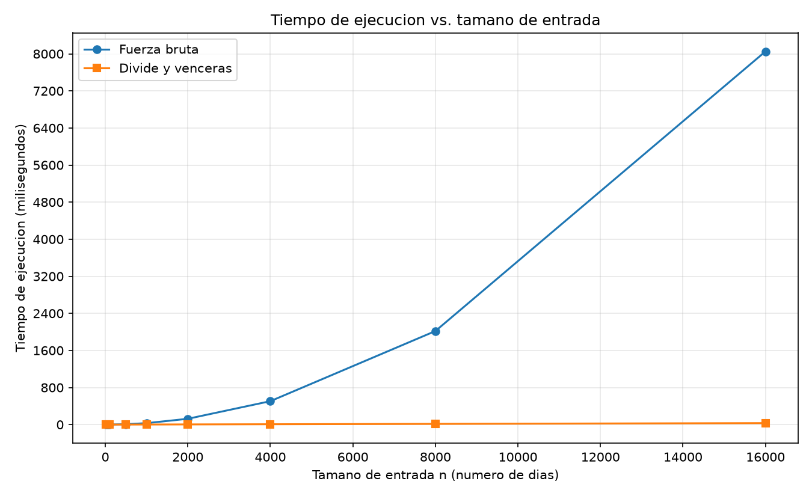

# Laboratorio #2 divide y vencerás

**Nombre:** Pablo Tabares Cardona

## Cómo reproducir el experimento

Este laboratorio vive dentro de la estructura del repositorio en `laboratorios/lab2-divide-y-vencer/`. Para ejecutarlo correctamente, hay que situarse en esa carpeta antes de correr los scripts.

**1. Ir a la carpeta del laboratorio**

```bash
cd laboratorios/lab2-divide-y-vencer
```

**2. Crear el entorno virtual**

```bash
python -m venv .venv
```

**3. Activarlo**

- Windows (CMD): `.venv\Scripts\activate`
- Windows (PowerShell): `.\.venv\Scripts\Activate.ps1`
- Linux y macOS: `source .venv/bin/activate`

**4. Instalar las dependencias del proyecto**

El repositorio define las dependencias en la raíz (`requirements.txt`), así que desde la raíz o usando la ruta relativa al laboratorio puede ejecutarse:

```bash
python -m pip install -r ../../requirements.txt
```

**5. Ejecutar las pruebas**

```bash
python pruebas.py
```

Si todo está bien, imprime `Todas las pruebas pasaron.`

**6. Ejecutar la medición**

```bash
python medicion.py
```

Este script imprime la tabla de tiempos y guarda las gráficas en la carpeta `graficas/` dentro de este laboratorio.

---

## Parte 1 — Implementar y verificar las dos soluciones

Código: [`subarreglo.py`](subarreglo.py) · Pruebas: [`pruebas.py`](pruebas.py)

Para comprobar que las dos soluciones funcionan, `pruebas.py` tiene los siguientes casos cubiertos:

- La serie de ocho días de la cooperativa (la mejor racha va del día 2 al 7 y suma 17).
- Series de un solo elemento (positivo, negativo y cero).
- Todos los valores negativos (la mejor racha es el valor menos negativo).
- Todos los valores positivos (la mejor racha es la serie completa).
- Una serie donde el mejor tramo cruza el punto medio.
- Una serie con valores decimales.
- 50 listas aleatorias  en las que ambos algoritmos deben dar la misma suma.


---

## Parte 2 — Medir y graficar

Código: [`medicion.py`](medicion.py)



**Medición:**

- Tamaños: 10, 50, 100, 500, 1000, 2000, 4000, 8000 y 16000 días.
- Los datos son enteros entre -100 y 100, generados con semilla fija (42), y **la misma lista** se usa para los dos algoritmos en cada tamaño.
- Se cronometra solo la llamada al algoritmo con `time.perf_counter()` generar los datos queda fuera del cronómetro.
- Cada medición se repite 5 veces hasta 1000 días, 3 veces hasta 4000 y 1 vez en los tamaños más grandes, se guarda el menor tiempo.
- En cada tamaño, el propio experimento verifica con un `assert` que ambos algoritmos dan la misma suma.

**Resultados en consola:**

| n | FB (ms) | DV (ms) | FB/DV | x n | x FB | x DV |
|------:|----------:|---------:|-------:|----:|-----:|-----:|
| 10 | 0.0046 | 0.0106 | 0.43 | - | - | - |
| 50 | 0.0851 | 0.0646 | 1.32 | 5.0 | 18.5 | 6.1 |
| 100 | 0.3323 | 0.1354 | 2.45 | 2.0 | 3.9 | 2.1 |
| 500 | 8.4847 | 0.7934 | 10.69 | 5.0 | 25.5 | 5.9 |
| 1000 | 34.0228 | 1.6889 | 20.14 | 2.0 | 4.0 | 2.1 |
| 2000 | 136.9582 | 3.5905 | 38.14 | 2.0 | 4.0 | 2.1 |
| 4000 | 547.6950 | 7.5360 | 72.68 | 2.0 | 4.0 | 2.1 |
| 8000 | 2251.3135 | 15.3275 | 146.88 | 2.0 | 4.1 | 2.0 |
| 16000 | 8807.2938 | 33.3169 | 264.35 | 2.0 | 3.9 | 2.2 |

FB = fuerza bruta, DV = divide y vencerás. "x n", "x FB" y "x DV" indican cuánto creció cada cosa respecto al tamaño anterior.

---

## Parte 3 — Análisis

### 1. Recurrencia

Mi `subarreglo_maximo` parte la serie por la mitad y busca tres cosas: la mejor racha de la mitad izquierda, la de la derecha y la que cruza por el medio. Se queda con la mayor.

**T(n) = 2·T(n/2) + Θ(n)**

- **2 subproblemas:** izquierda y derecha.
- **Tamaño n/2:** cada uno tiene la mitad de los días.
- **Θ(n):** el caso cruzado camina desde el medio hacia un lado y luego al otro, así que ve cada día una vez. Elegir entre las tres respuestas cuesta un tiempo fijo.
- **Caso base:** con un día, T(1) = Θ(1).

Método maestro: a = 2, b = 2, así que n^(log₂2) = n. Como f(n) = Θ(n) es del mismo orden, aplica el caso 2 (sin factor logarítmico extra) y **T(n) = Θ(n log n)**.

La fuerza bruta prueba, para cada día de inicio, todos los finales posibles, y cada prueba cuesta un tiempo fijo porque la suma se acumula. Son n + (n−1) + … + 1 = n(n+1)/2 pruebas, que crece como n²: **Θ(n²)**.

### 2. Lo medido contra lo esperado

En la gráfica, la fuerza bruta (azul) se dispara: de unos 600ms con 4.000 días a casi 8.000ms con 16.000. Divide y vencerás (naranja) parece pegada al fondo, pero también sube, despacio: de 7,5 a 33 ms.

De 4.000 a 8.000 días (n se duplica), la fuerza bruta se multiplicó por 4,1 (547,950 → 2.251,3135 ms) y divide y vencerás por 2,0 (7,5360 → 15,3275 ms). Θ(n²) predice ×4: coincide. Θ(n log n) predice un poco más de ×2 (unos 2,15 en estos tamaños, porque el logaritmo también crece): coincide.

### 3. Tamaños pequeños

Sí. Con 10 días gana la fuerza bruta (0,0046 ms contra 0,0106 ms); con 50 días ya gana divide y vencerás (0,0646 contra 0,0851 ms). El cambio ocurre entre 10 y 50 días. La ventaja nace pequeña (×1,3 con 50 días) y luego crece: ×10 con 500 y ×264 con 16.000.

Dividir tiene un costo fijo: cada llamada recursiva y cada caso cruzado son trámites. En listas cortas pesan más que el trabajo que se ahorra; al crecer n, el trabajo ahorrado crece mucho más rápido que los trámites. Además, con 10 días el tiempo es de milésimas de milisegundo y el ruido del computador se nota.

### 4. ¿Cuándo conviene dividir?

Para el máximo de un arreglo, dividir en mitades da: máximo izquierdo, máximo derecho y combinar con una sola comparación. La recurrencia es T(n) = 2·T(n/2) + Θ(1). Con el método maestro: a = 2, b = 2, n^(log₂2) = n, y f(n) = Θ(1) crece mucho menos que n; es el caso 1 y **T(n) = Θ(n)**.

Recorrerlo una vez también es Θ(n), así que dividir no mejora y además suma el costo de las llamadas recursivas. No se puede bajar de n: hay que mirar cada número.

Dividir conviene cuando juntar las respuestas es barato frente a lo que se ahorra. En el subarreglo, el método simple era Θ(n²) y dividir lo baja a Θ(n log n) pagando Θ(n) por combinar.

### 5. Concepto para la gerente

Recomiendo **divide y vencerás**. Con los 2.000 días de una tienda ambos sirven (137 ms contra 3,6 ms), pero la diferencia se vuelve enorme con series largas como las de los sensores.

**Esto es una estimación, no una medición.** Para 1.000.000 de registros:

- **Divide y vencerás (Θ(n log n)):** desde 16.000 días (33,3 ms), n se multiplica por 62,5 y el factor del logaritmo pasa de 14,0 a 19,9 (×1,43). Total: 62,5 × 1,43 ≈ 89 veces, es decir, unos 3.000 ms: **alrededor de 3 segundos**.
- **Fuerza bruta (Θ(n²)):** desde 8.807 ms con 16.000 días, el tiempo se multiplica por 62,5² ≈ 3.906, es decir, unos 34.400 s: **cerca de 9,5 horas**.

